# Linked List Library
[Link To Directory](https://github.com/trevorjdobson/data-structures-and-algorithms/tree/master/code401challenges/src/main/java/code401challenges/LinkedLists)
# Stacks and Queues Library
[Link To Directory](https://github.com/trevorjdobson/data-structures-and-algorithms/tree/master/code401challenges/src/main/java/code401challenges/stacksandqueues)
# Utilities Library
[Link To Directory](https://github.com/trevorjdobson/data-structures-and-algorithms/tree/master/code401challenges/src/main/java/code401challenges/utilities)
# Tree Library
[Link To Directory](https://github.com/trevorjdobson/data-structures-and-algorithms/tree/master/code401challenges/src/main/java/code401challenges/tree)
# Hash Table Library
[Link To Directory](https://github.com/trevorjdobson/data-structures-and-algorithms/tree/master/code401challenges/src/main/java/code401challenges/hashtable)
# Graph Library
[Link To Directory](https://github.com/trevorjdobson/data-structures-and-algorithms/tree/master/code401challenges/src/main/java/code401challenges/graph)
# Reverse an Array
First code challange working with arrays.

## Challenge
Write a function that takes in an array of integeres and reverses the array.

## Approach & Efficiency
I decided to use a for loop to swap the elements of the array in place.  I used the halfway point of the array as my stopping point for the for loop.

## Solution
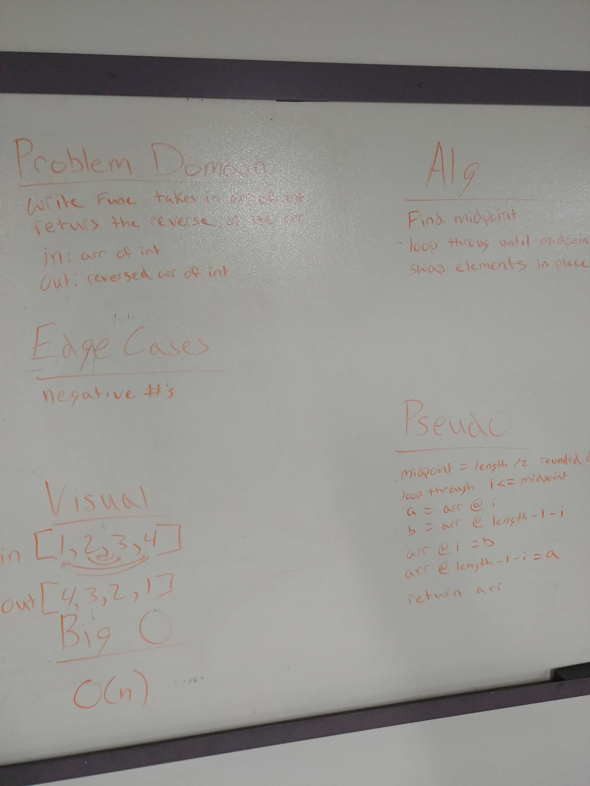

# Insert in Array
Second code challenge working with arrays

## Challenge
Write a function that takes in an array of integers and an interger and inserts that integer in the middle of the array.

## Approach & Efficiency
I first made a new array with the length being 1 more than the input array.  I then found the midpoint of that array.  I then looped through the new array inserting elements in their proper locations.

## Solution
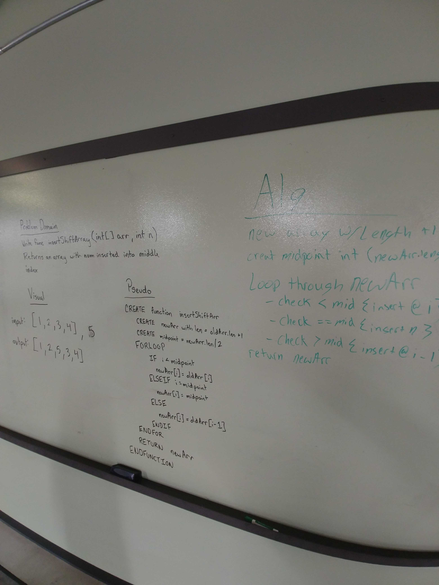

# Binary Search
Third Code Challenge with arrays.
## Challenge
Write a function that takes in a 1D array and a key that returns the index of the element that matches the key.  If the element does not exist return -1.  Do not use any built in methods.

## Approach & Efficiency
My first approach to this problem was to find the midpoint of the array. Then check if that element is bigger or smaller than the key.  Then find the midpoint of the remaining portion of the array based off of it being bigger or smaller and repeating that process until the key is found or there are no more to check.

## Solution
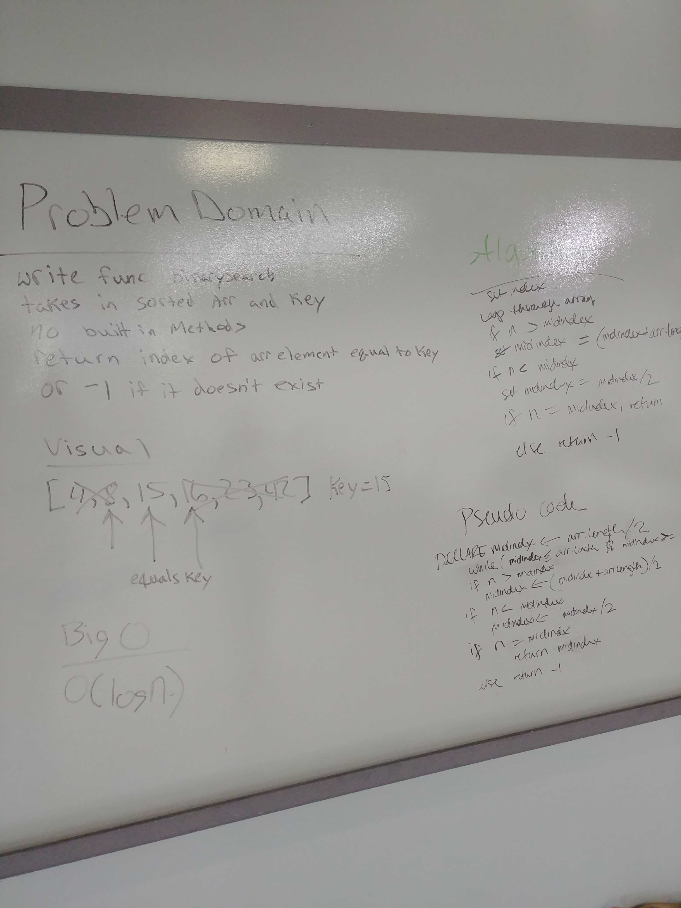

# Append Linked List
Third Code Challenge with arrays.
## Challenge
Write three methods that will append to the end of a linked list, that will append before a given element, and one that will append after a given element.

## Approach & Efficiency
The approach is pretty typical of a linked list.  Traverse it using a while loop looking for a key and then appending it in an appropriate place.

## Solution
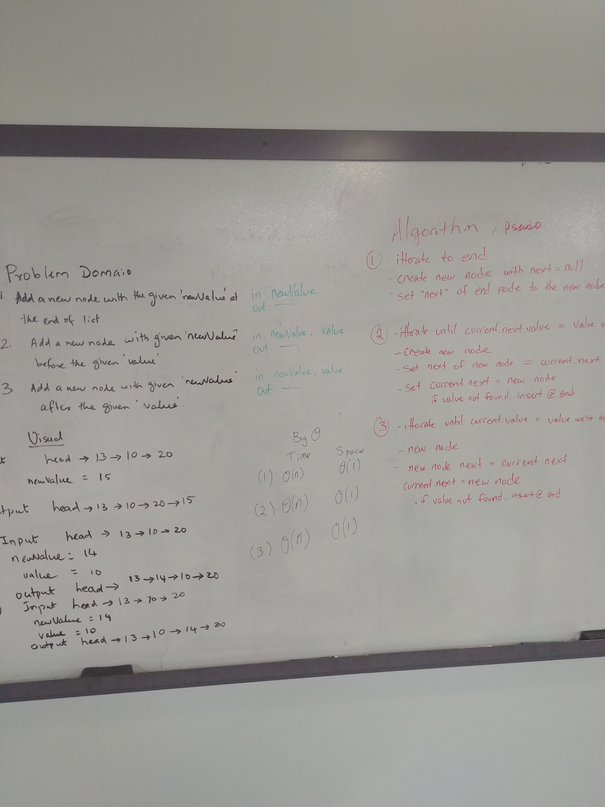

# K From End
Fourth Code Challenge with arrays.
## Challenge
Write a method that returns the value of the node at K from the end of the Linked List.

## Approach & Efficiency
The approach is pretty typical of a linked list.  Traverse it using a while loop looking for a key and then appending it in an appropriate place.

## Solution
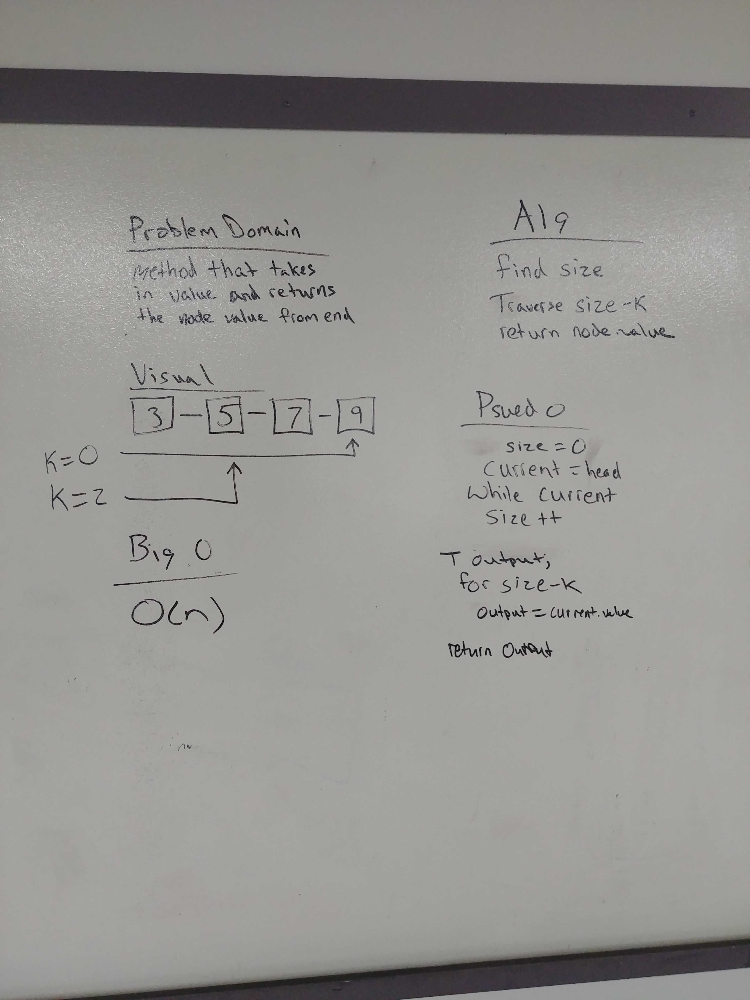

# Zipper Merge
Fifth Code Challenge with arrays.
## Challenge
Write a method that takes in two linked lists and returns a list that is merged together like a zipper.

## Approach & Efficiency
Create two "Currents" which reflect the current spot on each of the lists.  Traverse via a while loop as long as one of the currents still has a value.  If there is a value insert it into the new linked list.

## Solution
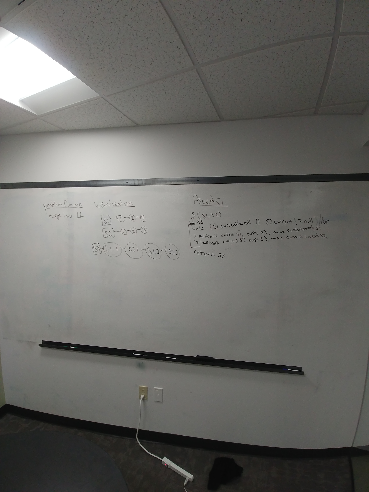

# Pseudo Queue

## Challenge
Write a new class called PseudoQueue.
This class should only utlize two stacks.  Then write a push and a pop method.

## Approach & Efficiency
If adding to the queue, check to see if the dequeue stack has nodes, if it does then pop from that stack and push to the enqueue stack after it is done going through the dequeue stack, push the value to the enqueue stack. Do the opposite for the dequeue method except return the final pop off the dequeue stack.

## Solution
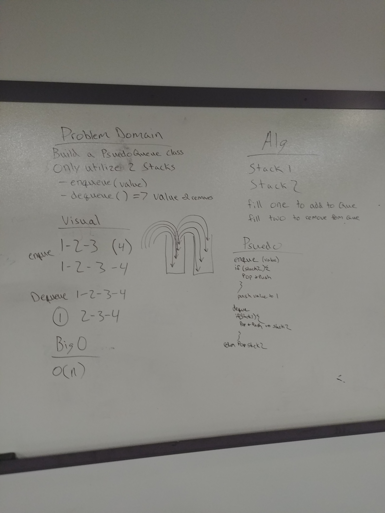

# Animal Shelter

## Challenge
Make a class called AnimalShelter which holds dogs and cats in a queue.  Write a method to add a cat or a dog.  Write a method to dequeue a cat or a dog which returns the value or null of the argument wasn't dog or cat.

## Approach & Efficiency
Create an animal class and a dog and cat class that extends the animal class.  Animal shelter will hold a dog queue and a cat queue.  Check the type of animal given and enqueue or dequeue from the appropriate queue.
## Solution
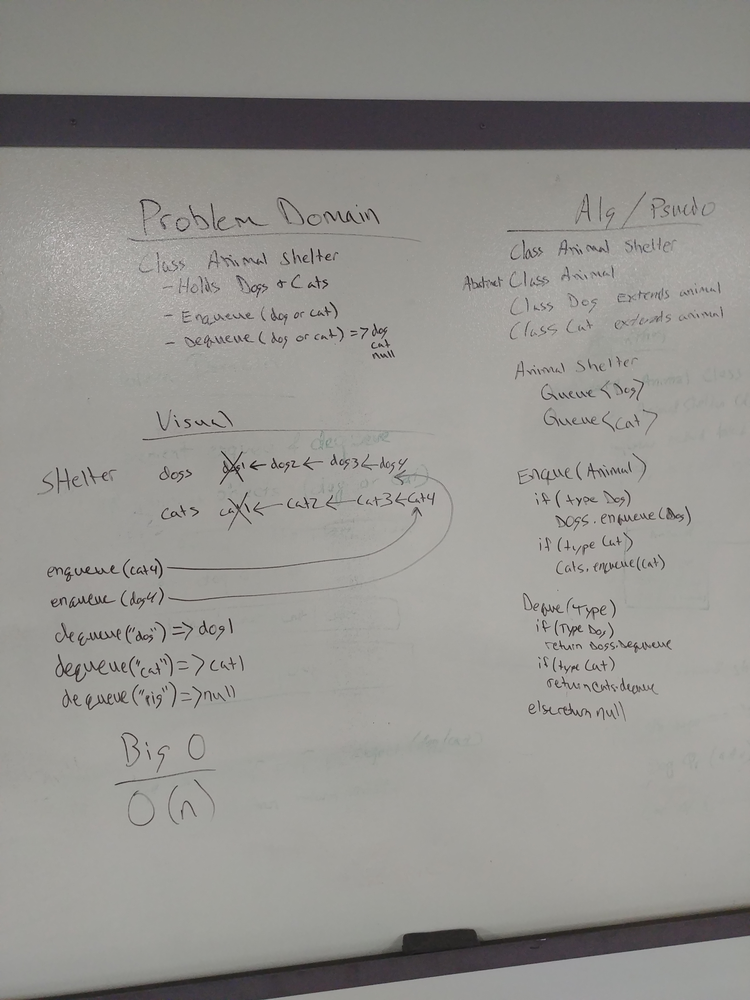

# Bracket Validation

## Challenge
Make a method that takes in a string and returns true or false based on if the brackets in that string are balanced.
## Approach & Efficiency
Make a stack to hole opening brackets.  If current char is an opening bracket it, push it to the stack.  If current char is a closing bracket it, pop from the stack and check that against the current char.
## Solution
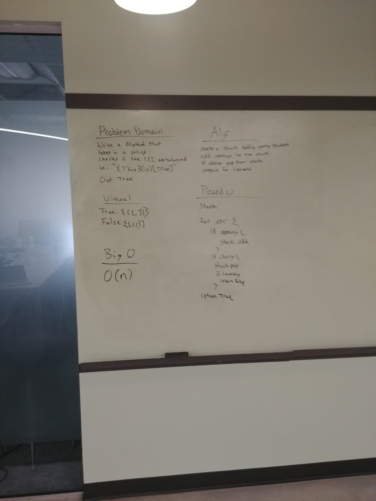

# FizzBuzzTree

## Challenge
Write a method that takes in a tree and turns the node values into "Fizz", "Buzz", or "FizzBuzz" if they are divisible by 3, 5, or both.
## Approach & Efficiency
Traverse the tree entirely checking first %3 && %5 then else check %3, then else check %5 changing the value if necessary. 
## Solution
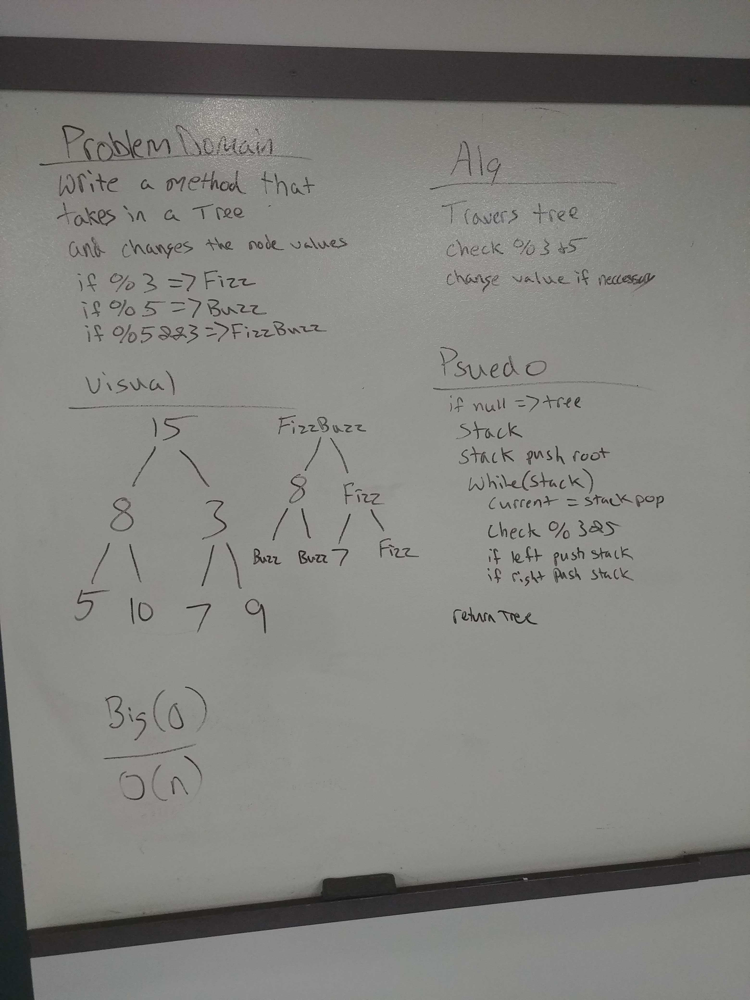

# Breadth First

## Challenge
Write a method that traverses a tree breadth first and prints out each node.
## Approach & Efficiency
Use a queue to hold my nodes and as long as that queue has something in it remove and print that node then add the nodes children to the queue.
## Solution
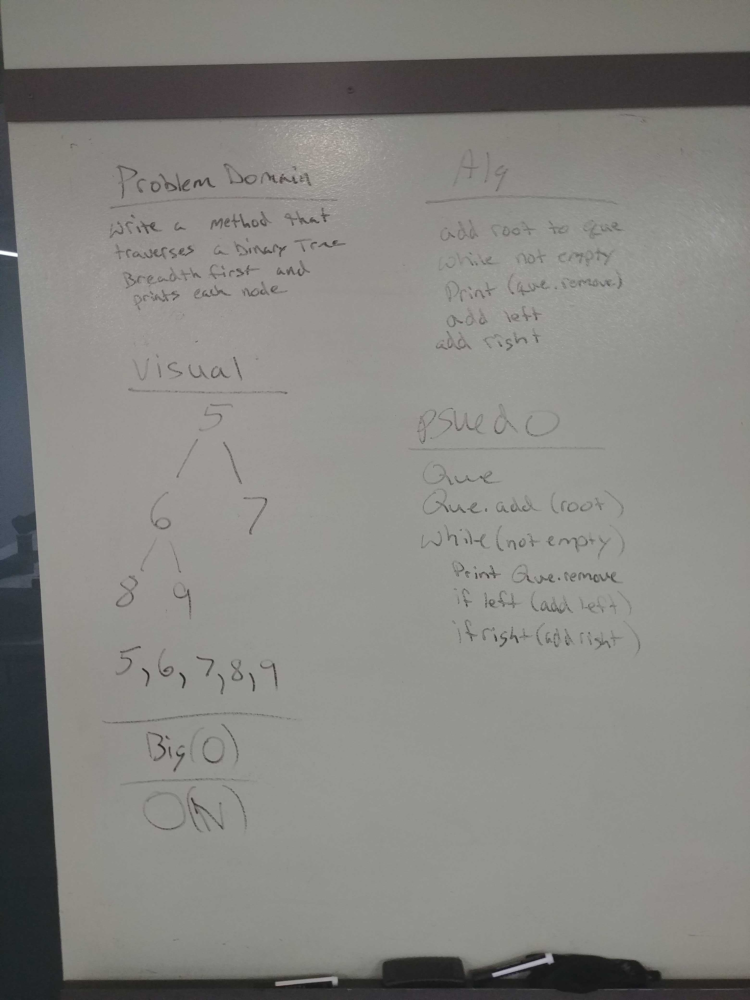

# FindMax

## Challenge
Write a method that returns the highest value in a tree.
## Approach & Efficiency
Traverse it breadth first holding a value for the largest and return that value after traversing.
## Solution
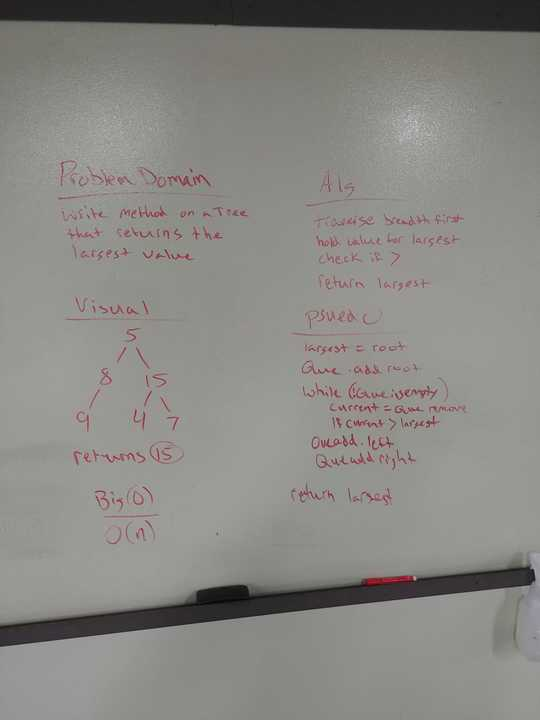

# First Repeated Word

## Challenge
Write a method that takes in a lengthy string and returns the first repeated word.
## Approach & Efficiency
Split the string on spaces, turn into hash table.  Use contains method to check and return.
# Hash Table Library
[Link To Directory](https://github.com/trevorjdobson/data-structures-and-algorithms/tree/master/code401challenges/src/main/java/code401challenges/hashtable)
## Solution
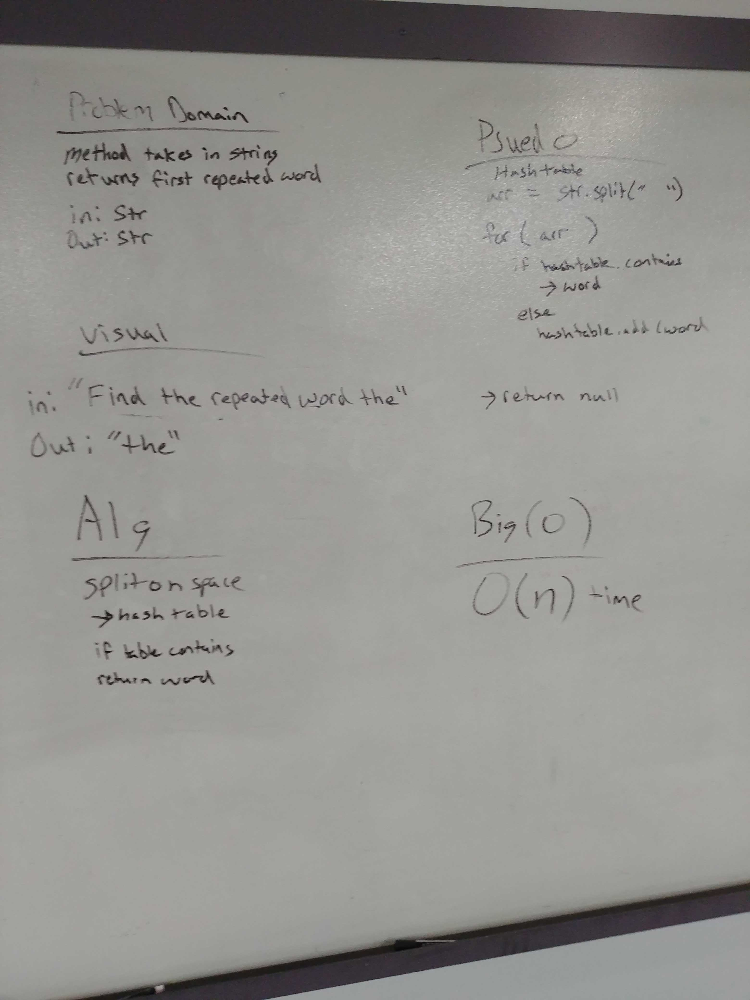

# Find Common Nodes In Tree

## Challenge
Write a method that takes in two trees and returns an array of common node values.
## Approach & Efficiency
Traverse the first tree checking each node value agains all the other nodes in the other tree.
# Tree Intersection Library
[Link To Directory](https://github.com/trevorjdobson/data-structures-and-algorithms/tree/master/code401challenges/src/main/java/code401challenges/treeIntersection)
## Solution
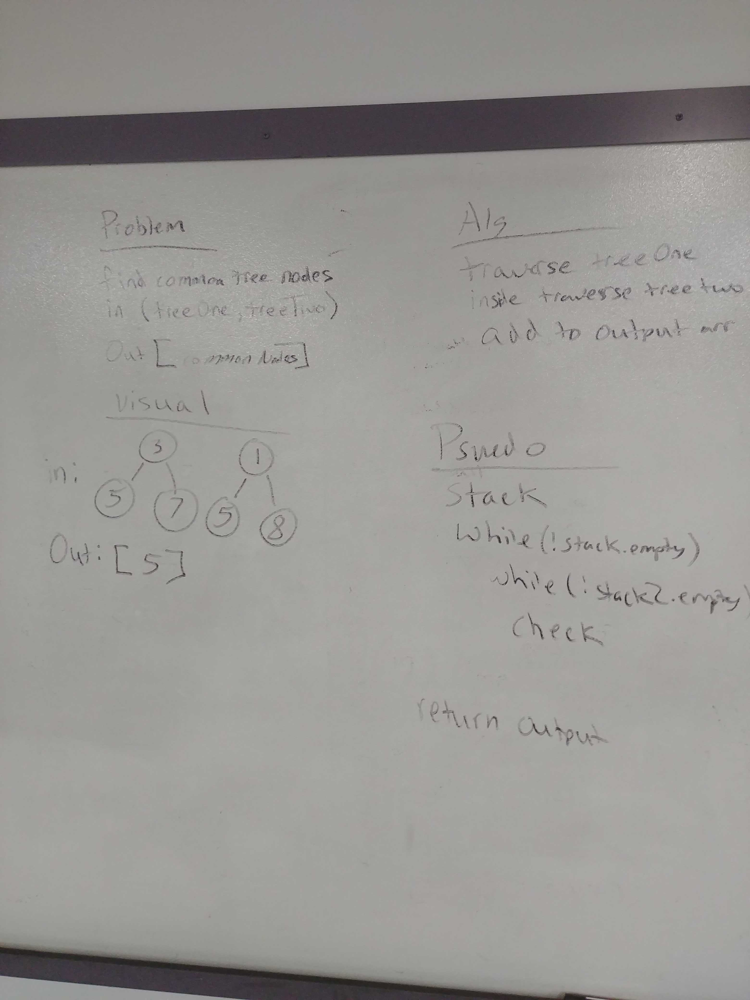
